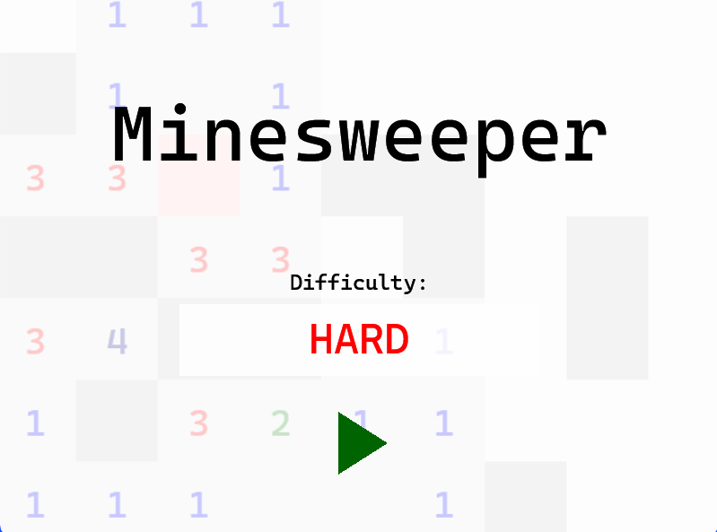
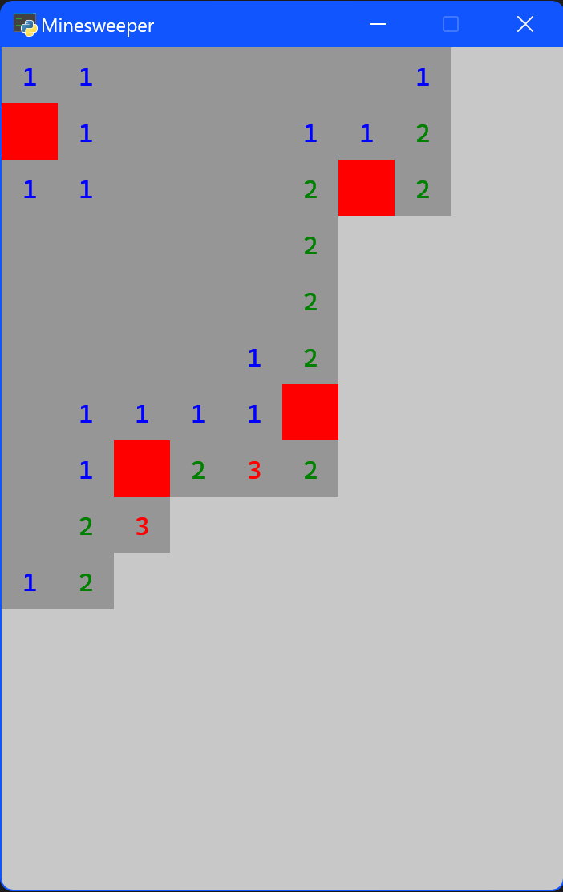

# Minesweeper-Py
## Python Minesweeper Game using Pyglet

## Overview
Minesweeper-Py is a Python implementation of the classic Minesweeper game, utilizing the Pyglet library for graphics rendering. The game features a user-friendly interface and supports multiple difficulty levels.

## Screenshots



## Installation

### Requirements:
- Python 3.x
- [Pyglet](https://pyglet.readthedocs.io/en/latest/) library

### Installing Pyglet:
```bash
pip install pyglet
```

### Clone the repository:
```bash
git clone https://github.com/yourusername/minesweeper-py.git
```

### To run the game type the following into the terminal:
```bash
python main.py
```


## Gameplay:
### Controls:
Left Click: Reveal a tile.

Right Click: Place or remove a flag on a tile.
### Objective:
Uncover all the non-mine tiles without triggering any mines. Use flags to mark suspected mines.

## Difficulty Levels:
*Easy:* 7x7 grid with 7 mines.

*Medium:* 10x10 grid with 15 mines.

*Hard:* 10x15 grid with 25 mines.

*Extreme:* 10x15 grid with 35 mines.

## Code Structure:
`main.py`
The main script that initializes the game window, handles user input, and manages game states.

`map.py`
Contains the Map class responsible for generating the game grid, placing mines, and handling tile uncovering logic.
